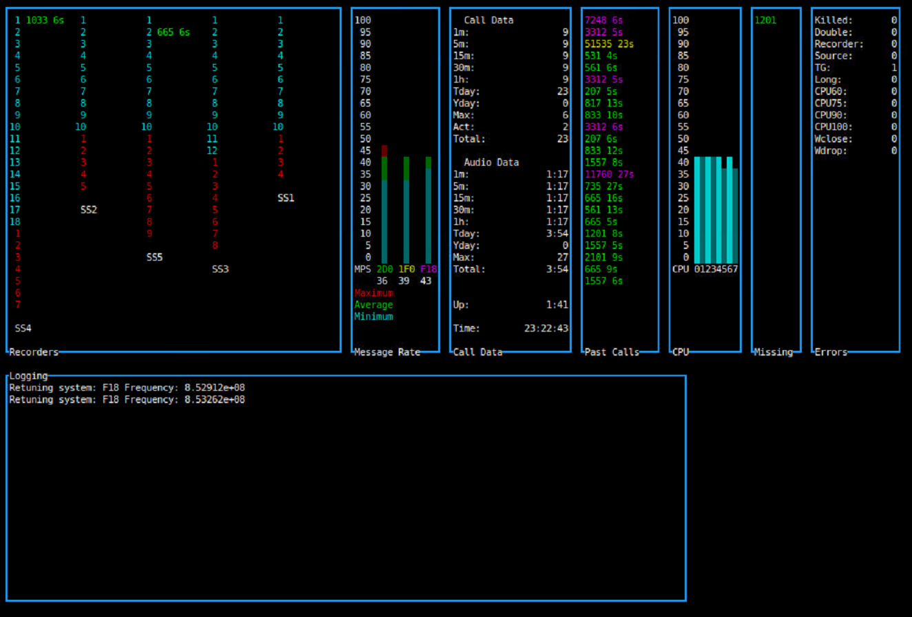
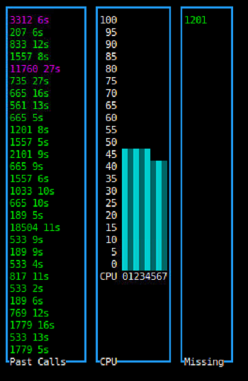
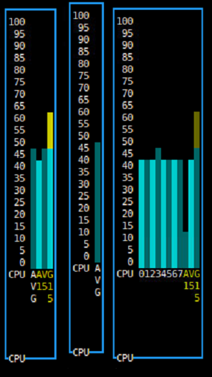

Trunk Recorder with Ncurses
=================
I'm going to leave the original instructions unchanged at the bottom of my additions.


### Config.json Changes
I've added some flags to the config file in order to control the default actions of ncurses.
with addition of the changes, the file should look like this at the end.
```
"captureDir": "$Capture_Directory",
"ncurses": 1,
"ncurses_group": 0,
"ncurses_cpu": 1,
"ncurses_dbg": 1,
"ncurses_lavg": 0
]
```

The options they control are as follows:
"ncurses": is the ncurses interface itself, 1 for enabled, 0 for disabled
"ncurses_group": is the default window assortment, 0 is all in the large format shown above (though rearranged as shown in pictures below), 1 is Recorders, Call Data, and Message Rate, 2 is Past Calls, CPU, and Missing (Missing talkgroups from the CSV files), and 3 is Errors and Logging in a smaller format. Pictures of all these are below.
"ncurses_cpu": This controls the default setting for having either individual CPU bars, or one average
"ncurses_dbg": This is not currently used but will eventually control debug/verbose logging on screen
"ncurses_lavg": This controls the default for having the system load average values (1, 5, 15 minute) along with the CPU window

I've also added different system tracking so I can keep things separate on the interface, so you have to add the hex system ID between the type and talkgroup file.
```
"type": "p25",
"sysId": "1f0",
"talkgroupsFile": "$TG.csv",
```
or
```
"type": "smartnet",
"sysId": "f18",
"talkgroupsFile": "$TG.csv",
```
One thing to note is that due to the way I've seen smartnet function and the networks around me work, I've fixed smartnet to always have a sysid of F18, I do not know what happens with a different network or multiple due to this, and I have remapped a 2D3 P25 system to read as 2D0 to match another repeater on that system. Both changes can be tweaked fairly easily if you look for where those strings exist in main.cc.

### Keyboard Controls
'0': Sets Window Group 0
'1': Sets Window Group 1
'2': Sets Window Group 2
'3': Sets Window Group 3
'4': Sets Window Group 4 (currently blank)
'C'/'c': Changes the ncurses_cpu value
'V'/'v': Changes the ncurses_lavg value
'R': Sends a resized window trigger redrawing all the windows
'r': Does a "clear()" at the next refresh, should clear out any std::cout messages stuck on the screen

### Group 0


### Group 1


### Group 2


### Group 3


### CPU Options



### Note: The format for the Config.json file has changed.
Trunk Recorder is able to record the calls on a trunked radio system. It uses 1 or more Software Defined Radios (SDRs) to do. The SDRs capture large swatches of RF and then use software to process what was received. GNURadio is used to do this processing and provides lots of convenient RF blocks that can be pieced together to do complex RF processing. Right now it can only record one Trunked System at a time.

Trunk Recorder currently supports the following:
 - P25 & SmartNet Trunking Systems
 - SDRs that use the OsmoSDR source ( HackRF, RTL - TV Dongles, BladeRF, and more)
 - Ettus USRP
 - P25 Phase 1 & Analog voice

I have tested things on both Unbuntu: 16.04, 14.04; OSX 10.10, OSX 10.11, 10.12. I have been using it with an Ettus b200, 3xRTL-SDR dongles and a HackRF Jawbreaker.

##Compile

###Requirements
 - GNURadio 3.7
 - (GR-DSD & OP25 used to be required, but I just bundled in a fork of OP25)

**GNURadio**

It is important to have a very recent version of GnuRadio (GR). There was a bug in earlier versions that messed up the SmartNet trunking. Make sure your install is up to date if you are having trouble decoding SmartNet trunking.

If you are running Linux, the easiest way to install GR is by using [Pybombs](http://gnuradio.org/redmine/projects/pybombs/wiki). After you have installed using pybombs, make sure you setup you Environment variables. In your pybombs directory, run: `./pybombs env` and then load them `source $prefix/setup_env.sh`, with $prefix being the directory you installed GR in.

If you are on OSX, the [MacPorts](https://gnuradio.org/redmine/projects/gnuradio/wiki/MacInstall) install has worked for me.

**Boost**
The Boost Libraries are needed. On Linux box, it can't hurt to do:
```
sudo apt-get install libboost-all-dev
```

**GR-DSD**

*GR-DSD is no longer needed. I couldn't get it to do a good job of decoding QPSK systems.*

**OP25**

*OP25 can do a good job of decoding QPSK systems. It has a bug though that causes it use lots of CPU. I have a branch that fixes this and have bundled it directly with Trunk Recorder. You do not need a separate install of OP25.*

###Trunk Recorder
Okay, with that out of the way, here is how you compile Trunk Recorder:
```
git clone https://github.com/robotastic/trunk-recorder.git
cd trunk-recorder
cmake -DCMAKE_PREFIX_PATH=/path/to/GR/install   .
make
```
Hopefully this should compile with no errors.

##Configure
Configuring Trunk Recorder and getting things setup can be rather complex. I am looking to make things simpler in the future.

**config.json**

This file is used to configure how Trunk Recorder is setup. It defines the SDRs that are available and the trunk system that will be recorded. The following is an example for my local system in DC, using an Ettus B200:

```
{
    "sources": [{
        "center": 857000000.0,
        "rate": 8000000.0,
        "squelch": -50,
        "error": 0,
        "gain": 40,
        "antenna": "TX/RX",
        "digitalRecorders": 2,
        "driver": "usrp",
        "device": ""
    }],
    "systems": [{
        "control_channels": [855462500],
        "type": "p25",
        "talkgroupsFile": "ChanList.csv"
    }],
    "modulation": "QPSK"
}
```
Here are the different arguments:
 - **sources** - an array of JSON objects that define the different SDRs available. The following options are used to configure each Source:
   - **center** - the center frequency in Hz to tune the SDR to
   - **rate** - the sampling rate to set the SDR to, in samples / second
   - **squelch** - Analog Squelch, my rtl-sdr's are around -60. [0 = Disabled]
   - **error** - the tuning error for the SDR in Hz. This is the difference between the target value and the actual value. So if you wanted to recv 856MHz but you had to tune your SDR to 855MHz to actually recieve it, you would set this to -1000000. You should also probably get a new SDR if it is off by this much.
   - **gain** - the RF gain to set the SDR to. Use a program like GQRX to find a good value.
   - **ifGain** - [hackrf only] sets the ifgain.
   - **bbGain** - [hackrf only] sets the bbgain.
   - **antenna** - [usrp] lets you select which antenna jack to user on devices that support it
   - **digitalRecorders** - the number of Digital Recorders to have attached to this source. This is essentially the number of simultaneous calls you can record at the same time in the frequency range that this Source will be tuned to. It is limited by the CPU power of the machine. Some experimentation might be needed to find the appropriate number.
   - **digitLevels** - the amount of amplification that will be applied to the digital audio. The value should be between 1-16. The default value is 8.
   - **modulation** - the type of modulation that the system uses. The options are *qpsk* & *fsk4*. It is possible to have a mix of sources using FSK4 and QPSK demodulation.
   - **analogRecorders** - the number of Analog Recorder to have attached to this source. This is the same as Digital Recorders except for Analog Voice channels.
   - **analogLevels** - the amount of amplification that will be applied to the analog audio. The value should be between 1-32. The default value is 8.
   - **debugRecorders** - the number of Debug Recorder to have attached to this source. Debug Recorders capture a raw sample that you can examine later using GNURadio Companion. This is helpful if you want to fine tune your the error and gain for this Source.
   - **driver** - the GNURadio block you wish to use for the SDR. The options are *usrp* & *osmosdr*.
   - **device** - osmosdr device name and possibly serial number or index of the device, see [osmosdr page](http://sdr.osmocom.org/trac/wiki/GrOsmoSDR) for each device and parameters. You only need to do this if there are more than one. (bladerf=00001 for BladeRF with serial 00001 or rtl=00923838 for RTL-SDR with serial 00923838, just airspy for an airspy)
 - **systems** - An array of JSON objects that define the trunking systems that will be recorded. The following options are used to configure each System.
   - **control_channels** - an array of the control channel frequencies for the system, in Hz. The frequencies will automatically be cycled through if the system moves to an alternate channel.
   - **type** - the type of trunking system. The options are *smartnet* & *p25*.
   - **talkgroupsFile** - this is a CSV file that provides information about the talkgroups. It determines whether a talkgroup is analog or digital, and what priority it should have. This file should be located in the same directory as the trunk-recorder executable.
   - **shortName** - this is a nickname for the system. It is used to help name and organize the recordings from this system. It should be 4-6 letters with no spaces.
   - **uploadScript** - this script is called after each recording has finished. Checkout *encode-upload.sh.sample* as an example. The script should be located in the same directory as the trunk-recorder executable.
 - **defaultMode** - Default mode to use when a talkgroups is not listed in the **talkgroupsFile** [digital/analog].
 - **captureDir** - the complete path to the directory where recordings should be saved.
 - **callTimeout** - a Call will stop recording and save if it has not received anything on the control channel, after this many seconds. The default is 3.

**ChanList.csv**

This file provides info on the different talkgroups in a trunking system. A lot of this info can be found on the Radio Reference website. You need to be a site member to download the table for your system. If you are not, try clicking on the "List All in one table" link, selecting everything in the table and copying it into Excel or a spreadsheet.

You will have to add an additional column that adds a priority for each talkgroup. You need that number of recorders available to record a call at that priority. So, 1 is the highest, you would need 2 recorders available to record a priority 2, 3 record for a priority 3 and so on.

The Trunk Record program really only uses the priority information and the Dec Talkgroup ID. The Website uses the same file though to help display information about each talkgroup.

Here are the column headers and some sample data:

| DEC |	HEX |	Mode |	Alpha Tag	| Description	| Tag |	Group | Priority |
|-----|-----|------|-----------|-------------|-----|-------|----------|
|101	| 065	| D	| DCFD 01 Disp	| 01 Dispatch |	Fire Dispatch |	Fire | 1 |
|2227 |	8b3	| D	| DC StcarYard	| Streetcar Yard |	Transportation |	Services | 3 |

###Multiple SDR
Most trunk systems use a wide range of spectrum. Often a more powerful SDR is needed to have enough bandwidth to capture all of the potential channels that a system may broadcast on. However it is possible to use multiple SDRs working together to cover all of the channels. This means that you can use a bunch of cheap RTL-SDR to capture an entire system.

In addition to being able to use a cheaper SDR, it also helps with performance. When a single SDR is used, each of the Recorders gets fed all of the sampled signal. Each Recorder needs to cut down the multi-megasamples per second into a small 12.5Khz sliver. When you use multiple SDRs, each SDR is capturing only partial slice of the system so the Recorders have to cut down a much smaller amount of sample to get to the sliver they are interested in. This menans that you can have a lot more recorders running!

To user mutliple SDRs, simply define additional Sources in the Source array. The `confing-multi-rtl.json.sample` has an example of how to do this. In order to tell the different SDRs apart and make sure they get the right error correction value, give them a serial number using the `rtl_eeprom -s` command and then specifying that number in the `device` setting for that Source.

###How Trunking Works
Here is a little background on trunking radio systems, for those not familiar. In a Trunking system, one of the radio channels is set aside for to manage the assignment of radio channels to talkgroups. When someone wants to talk, they send a message on the control channel. The system then assigns them a channel and sends a Channel Grant message on the control channel. This lets the talker know what channel to transmit on and anyone who is a member of the talkgroup know that they should listen to that channel.

In order to follow all of the transmissions, this system constantly listens to and decodes the control channel. When a channel is granted to a talkgroup, the system creates a monitoring process. This process will start to process and decode the part of the radio spectrum for that channel which the SDR is already pulling in.

No message is transmitted on the control channel when a talkgroup’s conversation is over. So instead the monitoring process keeps track of transmissions and if there has been no activity for 5 seconds, it ends the recording.
